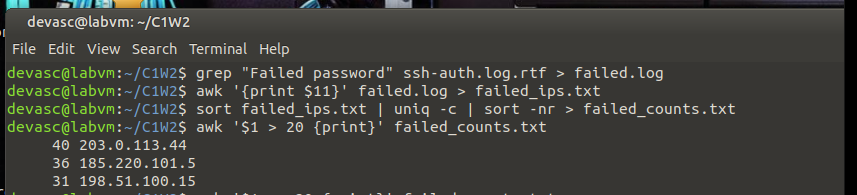
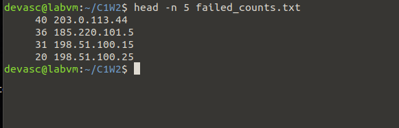
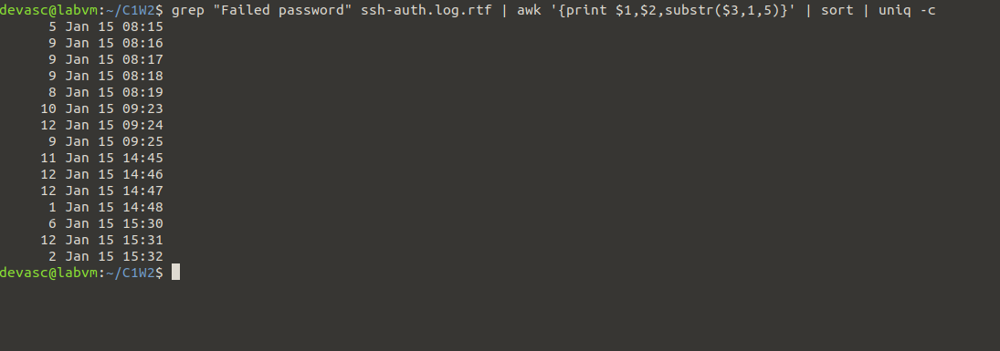

# Investigation Tasks

## Task 1: Brute Force Attack Detection (30 points)
Objective: Find evidence of SSH brute force attacks
Requirements:

### 1. Identify IP addresses with more than 20 failed SSH login attempts

Terminal image



#### Shell output
```bash
devasc@labvm:~/C1W2$ grep "Failed password" ssh-auth.log.rtf > failed.log
devasc@labvm:~/C1W2$ awk '{print $11}' failed.log > failed_ips.txt
devasc@labvm:~/C1W2$ sort failed_ips.txt | uniq -c | sort -nr > failed_counts.txt
devasc@labvm:~/C1W2$ awk '$1 > 20 {print}' failed_counts.txt
     40 203.0.113.44
     36 185.220.101.5
     31 198.51.100.15

```

#### Commands explained
a. `grep "Failed password" ssh-auth.log.rtf > failed.log` uses `grep` to search the log file for lines that contain "Failed password". Puts them into `failed.log` for easier parsing

b. `awk '{print $11}' failed.log > failed_ips.txt` For each line in failed.log, prints the 11th column (the attacker’s IP address). Puts this column into `failed_ips.txt` for easier parsing


c. `sort failed_ips.txt | uniq -c | sort -nr > failed_counts.txt` 

-  `sort` all ips into `failed_ips.txt`  

- `uniq -c` collapses duplicates and counts how many times each IP appears, since right now our file just has all the ips in plain text listed over and over again each time.


- `sort -nr` sorts the counts in numeric reverse order (biggest first).

d. `awk '$1 > 20 {print}' failed_counts.txt` looks at the first column in failed_counts.txt and prints anything over 20 failed login attempts, then displays only those IPs.


So to recap we filter the logs down to failed logins, pull the attacker IPs, count the failed ips, then list the IPs that failed over 20 times


### 2. Find the top 5 most aggressive attackers by failed login count





#### Shell output

```bash
devasc@labvm:~/C1W2$ head -n 5 failed_counts.txt
     40 203.0.113.44
     36 185.220.101.5
     31 198.51.100.15
     20 198.51.100.25
```
#### Commands explained
`head -n 5 failed_counts.txt`, head -n will show the top 5 lines in the file `failed_counts.txt` but  since the ssh log only contains 4 IPs only 4 were listed. 


### 3. Determine the time period of the most intense attack activity




#### Shell output
```bash
devasc@labvm:~/C1W2$ grep "Failed password" ssh-auth.log.rtf | awk '{print $1,$2,substr($3,1,5)}' | sort | uniq -c
      5 Jan 15 08:15
      9 Jan 15 08:16
      9 Jan 15 08:17
      9 Jan 15 08:18
      8 Jan 15 08:19
     10 Jan 15 09:23
     12 Jan 15 09:24
      9 Jan 15 09:25
     11 Jan 15 14:45
     12 Jan 15 14:46
     12 Jan 15 14:47
      1 Jan 15 14:48
      6 Jan 15 15:30
     12 Jan 15 15:31
      2 Jan 15 15:32
devasc@labvm:~/C1W2$ 
```

#### Command explained
 - `grep "Failed password" ssh-auth.log.rtf | awk '{print $1,$2,substr($3,1,5)}' | sort | uniq -c`
 
a. `grep "Failed password" ssh-auth.log.rtf` first looks at the `failed password` lines in the ssh log.
b. `awk '{print $1,$2,substr($3,1,5)}'` we then pipe into a command to split each log into space seperated columns for monday day time (1,2,3) and create a substring from 3, where we only take the first 5 characters. For example 15:30, (HH:MM) including the semi colon.
c. Lastly we pipe into a `sort` to sort minutes into order and `uniq -c` to collapse dupes.

### Findings

The attacker made steady attempts in bursts, usually 8–12 tries per minute. The heaviest attack windows were:
- 09:24 (12 failures)
- 14:46–14:47 (12 failures each minute)
- 15:31 (12 failures)


----------------------------------

## Task 2: Port Scanning Analysis (30 points)
Objective: Identify port scanning activities and their targets
Requirements:
1. Find IP addresses that scanned more than 40 different ports
2. Identify which internal servers were most heavily scanned
3. List the most commonly targeted ports

- Commands you'll need: grep, awk, sort, uniq, wc -l
- Deliverable: Screenshot of commands and a text summary in a section named 2. Port-scan-analysis in your final response document

-----------------------------------

## Task 3: Correlation Analysis (40 points)
Objective: Connect incidents across multiple log sources
Requirements:

1. Find IP addresses that appear in multiple log files (cross-reference attackers)
2. Create a timeline of coordinated attack activities

- Commands you'll need: grep -f, comm, join, sort, file redirection, awk
- Deliverable: Screenshot of commands and a text summary in a section named 3. Correlation-report

