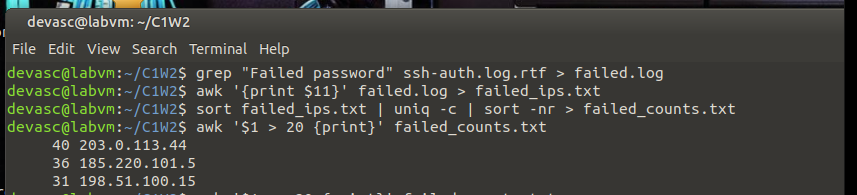
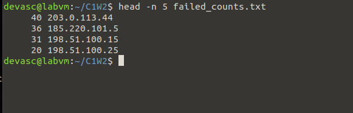
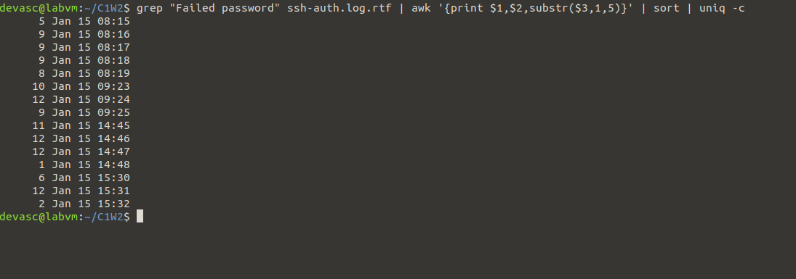
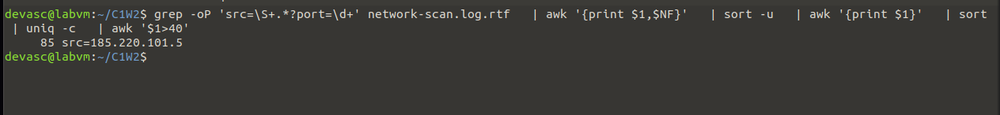
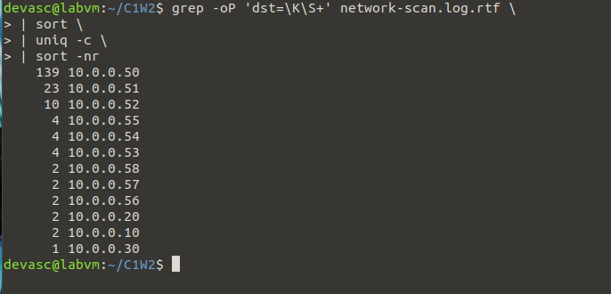
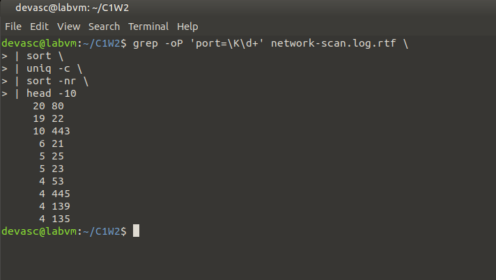
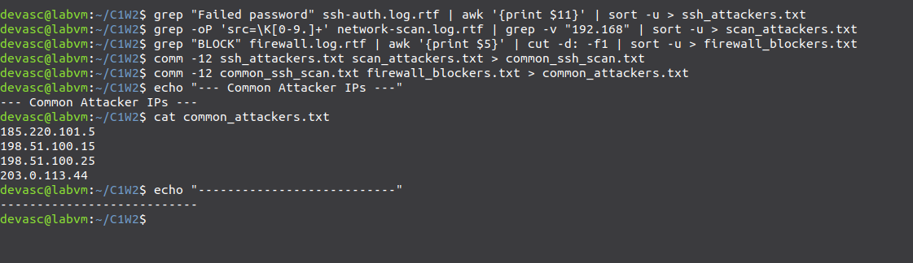

# Investigation Tasks
```
Scenario: You are a network security analyst who has just received suspicious log files from your organization's network infrastructure. Multiple security incidents may have occurred over the past week, and you need to analyze the logs to identify threats, document findings, and provide recommendations.

Your Mission: Use Linux command-line tools to analyze network logs, identify security incidents, and create a comprehensive security report.

Skills Focus: grep, awk, sed, sort, uniq, wc, file operations, text processing, cross-referencing data
```

------------------------------------------------------------------------------------------------------
------------------------------------------------------------------------------------------------------

## Task 1: Brute Force Attack Detection (30 points)
Objective: Find evidence of SSH brute force attacks
Requirements:

### 1. Identify IP addresses with more than 20 failed SSH login attempts

#### Task 1-1 screenshot



#### Task 1-1 shell output
```bash
devasc@labvm:~/C1W2$ grep "Failed password" ssh-auth.log.rtf > failed.log
devasc@labvm:~/C1W2$ awk '{print $11}' failed.log > failed_ips.txt
devasc@labvm:~/C1W2$ sort failed_ips.txt | uniq -c | sort -nr > failed_counts.txt
devasc@labvm:~/C1W2$ awk '$1 > 20 {print}' failed_counts.txt
     40 203.0.113.44
     36 185.220.101.5
     31 198.51.100.15

```

#### Task 1-1 overview
a. `grep "Failed password" ssh-auth.log.rtf > failed.log` uses `grep` to search the log file for lines that contain "Failed password". Puts them into `failed.log` for easier parsing

b. `awk '{print $11}' failed.log > failed_ips.txt` For each line in failed.log, prints the 11th column (the attacker’s IP address). Puts this column into `failed_ips.txt` for easier parsing


c. `sort failed_ips.txt | uniq -c | sort -nr > failed_counts.txt` 

-  `sort` all ips into `failed_ips.txt`  

- `uniq -c` collapses duplicates and counts how many times each IP appears, since right now our file just has all the ips in plain text listed over and over again each time.


- `sort -nr` sorts the counts in numeric reverse order (biggest first).

d. `awk '$1 > 20 {print}' failed_counts.txt` looks at the first column in failed_counts.txt and prints anything over 20 failed login attempts, then displays only those IPs.


So to recap we filter the logs down to failed logins, pull the attacker IPs, count the failed ips, then list the IPs that failed over 20 times


### 2. Find the top 5 most aggressive attackers by failed login count


#### Task 1-2 screenshot




#### Task 1-2 shell output

```bash
devasc@labvm:~/C1W2$ head -n 5 failed_counts.txt
     40 203.0.113.44
     36 185.220.101.5
     31 198.51.100.15
     20 198.51.100.25
```
#### Task 1-2 overview

`head -n 5 failed_counts.txt`, head -n will show the top 5 lines in the file `failed_counts.txt` but  since the ssh log only contains 4 IPs only 4 were listed. 


### 3. Determine the time period of the most intense attack activity

#### Task 1-3 screenshot




#### Task 1-3 shell output
```bash
devasc@labvm:~/C1W2$ grep "Failed password" ssh-auth.log.rtf | awk '{print $1,$2,substr($3,1,5)}' | sort | uniq -c
      5 Jan 15 08:15
      9 Jan 15 08:16
      9 Jan 15 08:17
      9 Jan 15 08:18
      8 Jan 15 08:19
     10 Jan 15 09:23
     12 Jan 15 09:24
      9 Jan 15 09:25
     11 Jan 15 14:45
     12 Jan 15 14:46
     12 Jan 15 14:47
      1 Jan 15 14:48
      6 Jan 15 15:30
     12 Jan 15 15:31
      2 Jan 15 15:32
devasc@labvm:~/C1W2$ 
```

#### Task 1-3 overview
  `grep "Failed password" ssh-auth.log.rtf | awk '{print $1,$2,substr($3,1,5)}' | sort | uniq -c`
 
- a. `grep "Failed password" ssh-auth.log.rtf` first looks at the `failed password` lines in the ssh log.
- b. `awk '{print $1,$2,substr($3,1,5)}'` we then pipe into a command to split each log into space seperated columns for monday day time (1,2,3) and create a substring from 3, where we only take the first 5 characters. For example 15:30, (HH:MM) including the semi colon.
- c. Lastly we pipe into a `sort` to sort minutes into order and `uniq -c` to collapse dupes.


### Task 1 Brute-force-report 

Three main attacker IPs exceeded 20 failed SSH attempts:
- `203.0.113.44` (40 attempts)
- `185.220.101.5` (36 attempts)
- `198.51.100.15` (31 attempts)

Top brute force activity came from these IPs, with repeated bursts of 8–12 failures per minute. 

The attacker made steady attempts in bursts, usually 8–12 tries per minute. The heaviest attack windows were:
- 09:24 (12 failures)
- 14:46–14:47 (12 failures each minute)
- 15:31 (12 failures)

------------------------------------------------------------------------------------------------------
------------------------------------------------------------------------------------------------------

## Task 2: Port Scanning Analysis (30 points)
Objective: Identify port scanning activities and their targets

Requirements:
### 1. Find IP addresses that scanned more than 40 different ports


####  Task 2-1 screenshot




####  Task 2-1 shell output

```bash
devasc@labvm:~/C1W2$ grep -oP 'src=\S+.*?port=\d+' network-scan.log.rtf \
>   | awk '{print $1,$NF}' \
>   | sort -u \
>   | awk '{print $1}' \ 
>   | sort \
>   | uniq -c \
>   | awk '$1>40'
     85 src=185.220.101.5
```
#### Task 2-1 overview
- `grep -oP 'src=\S+.*?port=\d+' network-scan.log.rtf \`  : extract `src=IP ... port=PORT` fields
- `| awk '{print $1,$NF}' \`                              : keep only `src=IP` and `port=PORT`
- `| sort -u \`                                           : de-duplicate (src,port) pairs
- `| awk '{print $1}' \`                                  : strip down to just `src=IP`
- `| sort \`                                              : sort IPs
- `| uniq -c \`                                           : count **unique ports per src**
- `| awk '$1>40' \`                                       : show only IPs with >40 unique ports
- `| sort -nr`                                            : sort biggest scanners first


 **Note:**  
Originally I had `| cut -d' ' -f1 \` in the pipeline.  

That dropped the **port information** too early, so `uniq -c` only counted duplicate log entries per IP (including repeats on different destinations).  

The corrected pipeline uses `awk '{print $1,$NF}'` to keep both the source IP and the port until after deduplication, ensuring the counts reflect **unique ports per IP**.

---


### 2. Identify which internal servers were most heavily scanned

#### Task 2-2 screenshot



#### Task 2-2 screenshot shell output
```bash
devasc@labvm:~/C1W2$ grep -oP 'dst=\K\S+' network-scan.log.rtf \
> | sort \
> | uniq -c \
> | sort -nr
    139 10.0.0.50
     23 10.0.0.51
     10 10.0.0.52
      4 10.0.0.55
      4 10.0.0.54
      4 10.0.0.53
      2 10.0.0.58
      2 10.0.0.57
      2 10.0.0.56
      2 10.0.0.20
      2 10.0.0.10
      1 10.0.0.30
devasc@labvm:~/C1W2$    

```
#### Task 2-2 overview

- `grep -oP 'dst=\K\S+' network-scan.log.rtf \` : extract only the dst=SERVER addresses per line via regex 
- `| sort \` : sorts so we can group identical servers together
- `| uniq -c \` : count how many times each server was scanned
- `| sort -nr`:  sort results numerically, biggest first


### 3. List the most commonly targeted ports

####  Task 2-3 screenshot 




#### Task 2-3 shell output
```bash
devasc@labvm:~/C1W2$ grep -oP 'port=\K\d+' network-scan.log.rtf \
> | sort \
> | uniq -c \
> | sort -nr \
> | head -10
     20 80
     19 22
     10 443
      6 21
      5 25
      5 23
      4 53
      4 445
      4 139
      4 135
```

#### Task 2-3 overview

* `grep -oP 'port=\K\d+' network-scan.log.rtf \` : extract only the port numbers from each line via regex
* `| sort \` : sorts so we can group identical port numbers together
* `| uniq -c \` : count how many times each port was scanned
* `| sort -nr \` : sort results numerically, biggest first
* `| head -10` : show only the **top 10 most scanned ports**


### Task 2 port-scan-analysis:

- The IP addresses that scanned *more than 40* different ports were `src=185.220.101.5` with `85` ports scanned. 

- The 3 most scanned internal servers had the following ips `10.0.0.50` 139 times, `10.0.0.51` 23 times and `10.0.0.52` 10 times.

- `port 80` with 20 scans, `port 22` with 19 scans and `port 443` with 10 commands were the top 3 most scanned ports.


------------------------------------------------------------------------------------------------------
------------------------------------------------------------------------------------------------------


## Task 3: Correlation Analysis (40 points)
Objective: Connect incidents across multiple log sources
Requirements:

1. Find IP addresses that appear in multiple log files (cross-reference attackers)
2. Create a timeline of coordinated attack activities

- Commands you'll need: grep -f, comm, join, sort, file redirection, awk
- Deliverable: Screenshot of commands and a text summary in a-named 3. Correlation-report


#### Task 3-1 screenshot



#### Task 3-1 shell output

```bash
devasc@labvm:~/C1W2$ grep "Failed password" ssh-auth.log.rtf | awk '{print $11}' | sort -u > ssh_attackers.txt
devasc@labvm:~/C1W2$ grep -oP 'src=\K[0-9.]+' network-scan.log.rtf | grep -v "192.168" | sort -u > scan_attackers.txt
devasc@labvm:~/C1W2$ grep "BLOCK" firewall.log.rtf | awk '{print $5}' | cut -d: -f1 | sort -u > firewall_blockers.txt
devasc@labvm:~/C1W2$ comm -12 ssh_attackers.txt scan_attackers.txt > common_ssh_scan.txt
devasc@labvm:~/C1W2$ comm -12 common_ssh_scan.txt firewall_blockers.txt > common_attackers.txt
devasc@labvm:~/C1W2$ echo "IPs found performing malicious activity across all logs:"
IPs found performing malicious activity across all logs:
devasc@labvm:~/C1W2$ cat common_attackers.txt
185.220.101.5
198.51.100.15
198.51.100.25
203.0.113.44
```

#### Task 3-1 overview


#### Task 3-2 screenshot


#### Task 3-2 shell output

 First, we create a master timeline by reformatting all raw logs into a single,chronologically sorted file containing only the attackers' activities

```bash
devasc@labvm:~/C1W2$ awk 'BEGIN{m["Jan"]="01"} /Failed password/ {print "2025-"m[$1]"-"$2, $3, "[SSH]", $0}' ssh-auth.log.rtf > formatted_ssh.log
devasc@labvm:~/C1W2$ awk '/SCAN_DETECT/ {print $1, $2, "[SCAN]", $0}' network-scan.log.rtf > formatted_scan.log
devasc@labvm:~/C1W2$ awk '/BLOCK/ {print $1, $2, "[FIREWALL]", $0}' firewall.log.rtf > formatted_firewall.log
devasc@labvm:~/C1W2$ cat formatted_*.log > all_events.log
devasc@labvm:~/C1W2$ grep -f common_attackers.txt all_events.log | sort -k1,2 > coordinated_attack_timeline.txt
devasc@labvm:~/C1W2$ { echo -e "\n\n--- Coordinated Attack Timeline ---"; head -n 15 coordinated_attack_timeline.txt; echo -e "------------------------------------------\n\n"; }


--- Coordinated Attack Timeline  ---
2025-01-15 08:15:15 [SCAN] 2025-01-15 08:15:15 SCAN_DETECT src=203.0.113.44 dst=10.0.0.50 port=21 protocol=TCP status=CLOSED\
2025-01-15 08:15:16 [SCAN] 2025-01-15 08:15:16 SCAN_DETECT src=203.0.113.44 dst=10.0.0.50 port=22 protocol=TCP status=CLOSED\
2025-01-15 08:15:17 [SCAN] 2025-01-15 08:15:17 SCAN_DETECT src=203.0.113.44 dst=10.0.0.50 port=23 protocol=TCP status=CLOSED\
2025-01-15 08:15:18 [SCAN] 2025-01-15 08:15:18 SCAN_DETECT src=203.0.113.44 dst=10.0.0.50 port=25 protocol=TCP status=CLOSED\
2025-01-15 08:15:19 [SCAN] 2025-01-15 08:15:19 SCAN_DETECT src=203.0.113.44 dst=10.0.0.50 port=53 protocol=TCP status=CLOSED\
2025-01-15 08:15:20 [SCAN] 2025-01-15 08:15:20 SCAN_DETECT src=203.0.113.44 dst=10.0.0.50 port=80 protocol=TCP status=OPEN\
2025-01-15 08:15:20 [SSH] Jan 15 08:15:20 server1 sshd[1003]: Failed password for root from 203.0.113.44 port 12345\
2025-01-15 08:15:21 [SCAN] 2025-01-15 08:15:21 SCAN_DETECT src=203.0.113.44 dst=10.0.0.50 port=110 protocol=TCP status=CLOSED\
2025-01-15 08:15:22 [SCAN] 2025-01-15 08:15:22 SCAN_DETECT src=203.0.113.44 dst=10.0.0.50 port=135 protocol=TCP status=CLOSED\
2025-01-15 08:15:23 [SCAN] 2025-01-15 08:15:23 SCAN_DETECT src=203.0.113.44 dst=10.0.0.50 port=139 protocol=TCP status=CLOSED\
2025-01-15 08:15:24 [SCAN] 2025-01-15 08:15:24 SCAN_DETECT src=203.0.113.44 dst=10.0.0.50 port=143 protocol=TCP status=CLOSED\
2025-01-15 08:15:25 [FIREWALL] 2025-01-15 08:15:25 BLOCK TCP 203.0.113.44:12345 -> 10.0.0.50:22\
2025-01-15 08:15:25 [SCAN] 2025-01-15 08:15:25 SCAN_DETECT src=203.0.113.44 dst=10.0.0.50 port=443 protocol=TCP status=OPEN\
2025-01-15 08:15:26 [SCAN] 2025-01-15 08:15:26 SCAN_DETECT src=203.0.113.44 dst=10.0.0.50 port=445 protocol=TCP status=CLOSED\
2025-01-15 08:15:27 [FIREWALL] 2025-01-15 08:15:27 BLOCK TCP 203.0.113.44:12346 -> 10.0.0.50:23\
------------------------------------------
```

- Second, we process the master timeline to generate a separate report for each adversary, appending an hourly summary of their actions to each file
```bash
devasc@labvm:~/C1W2$ for ip in $(cat common_attackers.txt); do
>   filename="adversary_${ip}.log"
>   summary_temp_file="summary.tmp"
>   echo "--> Creating clean report for $ip"
>   
>   grep "$ip" coordinated_attack_timeline.txt > "$filename"
>   awk '{print substr($2, 1, 2)":00", $3}' "$filename" | sort | uniq -c > "$summary_temp_file"
>   
>   echo -e "\n\n=========================================" >> "$filename"
>   echo "      HOURLY ACTIVITY SUMMARY" >> "$filename"
>   echo "=========================================" >> "$filename"
>   cat "$summary_temp_file" >> "$filename"
> done
--> Creating clean report for 185.220.101.5
--> Creating clean report for 198.51.100.15
--> Creating clean report for 198.51.100.25
--> Creating clean report for 203.0.113.44
devasc@labvm:~/C1W2$ rm "$summary_temp_file"
```


- Finally, we verify the reports by displaying the end of each file, confirming the logs and showing a summary of what each attacker did.

```bash
devasc@labvm:~/C1W2$ tail -n 10 adversary_*.log
==> adversary_185.220.101.5.log <==
2025-01-15 14:47:55 [SSH] Jan 15 14:47:55 server1 sshd[3035]: Failed password for root from 185.220.101.5 port 43244\
2025-01-15 14:48:00 [SSH] Jan 15 14:48:00 server1 sshd[3036]: Failed password for monkey from 185.220.101.5 port 43245\


=========================================
      HOURLY ACTIVITY SUMMARY
=========================================
     20 09:00 [FIREWALL]
     85 14:00 [SCAN]
     36 14:00 [SSH]

==> adversary_198.51.100.15.log <==
2025-01-15 09:25:35 [SSH] Jan 15 09:25:35 server1 sshd[2030]: Failed password for admin from 198.51.100.15 port 54350\
2025-01-15 09:25:40 [SSH] Jan 15 09:25:40 server1 sshd[2031]: Failed password for root from 198.51.100.15 port 54351\


=========================================
      HOURLY ACTIVITY SUMMARY
=========================================
     21 08:00 [FIREWALL]
     53 09:00 [SCAN]
     31 09:00 [SSH]

==> adversary_198.51.100.25.log <==
2025-01-15 15:32:00 [SSH] Jan 15 15:32:00 server1 sshd[4023]: Failed password for root from 198.51.100.25 port 12363\
2025-01-15 15:32:05 [SSH] Jan 15 15:32:05 server1 sshd[4024]: Failed password for 123456 from 198.51.100.25 port 12364}


=========================================
      HOURLY ACTIVITY SUMMARY
=========================================
     20 14:00 [FIREWALL]
     16 15:00 [SCAN]
     20 15:00 [SSH]

==> adversary_203.0.113.44.log <==
2025-01-15 08:19:40 [SSH] Jan 15 08:19:40 server1 sshd[1055]: Failed password for admin from 203.0.113.44 port 12383\
2025-01-15 08:19:45 [SSH] Jan 15 08:19:45 server1 sshd[1056]: Failed password for root from 203.0.113.44 port 12384\


=========================================
      HOURLY ACTIVITY SUMMARY
=========================================
     22 08:00 [FIREWALL]
     36 08:00 [SCAN]
     40 08:00 [SSH]
devasc@labvm:~/C1W2$ 
```


#### Task 3-2 overview

This analysis transforms raw, separate logs into a unified, actionable intelligence report. The process involves three key phases: aggregating and standardizing the data into a master timeline, generating individual reports for each adversary, and finally, verifying the output.


### Step 1: Create a Master Timeline

The first goal is to combine all relevant events from the different log files into a single, chronologically sorted timeline.

* **`awk`**: Three separate **`awk`** commands are used to process each raw log file. This powerful tool reformats the inconsistent timestamps into a standard `YYYY-MM-DD HH:MM:SS` format and adds a source tag like **`[SSH]`**, **`[SCAN]`**, or **`[FIREWALL]`**. This standardization is essential for sorting and correlation.
* **`cat`**: The **`cat`** command concatenates the three newly formatted intermediate files into a single master event log called **`all_events.log`**.
* **`grep -f`**: This command filters the master log. Using the list of IPs in **`common_attackers.txt`** as a pattern file (`-f`), it extracts only the log entries corresponding to our four known adversaries.
* **`sort`**: Finally, **`sort`** arranges all the filtered attacker events chronologically, creating the definitive **`coordinated_attack_timeline.txt`**.

### Step 2: Generate Adversary Reports

This phase uses a **`for` loop** to automate the creation of a dedicated, summarized report for each of the four attackers.

* **`grep`**: Inside the loop, **`grep`** pulls all activity for a single attacker's IP from the master timeline and uses the `>` operator to create (or overwrite) a clean, dedicated report file (e.g., **`adversary_203.0.113.44.log`**).
* **`awk | sort | uniq -c`**: This pipeline performs the core analysis for the summary. **`awk`** extracts the hour and the action tag from the new report; **`sort`** and **`uniq -c`** then count the number of times each action occurred per hour. This result is saved to a temporary file.
* **`cat` and `>>`**: The summary header and the contents of the temporary summary file are appended to the end of the adversary's report using **`cat`** and the `>>` operator, completing the individual report.

### Step 3: Verify the Final Reports

This final, simple command quickly confirms that the entire process was successful.

* **`tail -n 10 adversary_*.log`**: The **`tail`** command shows the last 10 lines of a file. By using the wildcard (`*`), it efficiently targets all four **`adversary_*.log`** reports at once. This allows you to instantly see the end of each file, confirming that the hourly summary was appended correctly and is properly formatted.


### Task 3 Correlation-report


Analysis across firewall, network scan, and SSH authentication logs confirms a coordinated attack against the network on January 15, 2025. Four external IP addresses were identified as adversaries, each participating in a systematic pattern of reconnaissance and attack:

* `203.0.113.44`
* `198.51.100.15`
* `185.220.101.5`
* `198.51.100.25`

The attacks occurred in two distinct waves and followed a clear methodology: reconnaissance via **port scanning**, followed immediately by exploitation attempts via **SSH brute-force attacks**. All attempts were successfully mitigated by firewall blocks.

#### Timeline and Adversary Analysis

The correlated data reveals a structured, multi-stage attack pattern:

**1. Morning Attack Wave (08:00 - 09:00)**
* **`203.0.113.44`**: This was the most aggressive morning attacker, launching all 98 of its malicious actions within the 8 AM hour. The timeline shows it performed 36 port scans to identify services, then immediately launched 40 SSH brute-force attempts, resulting in 22 firewall blocks.
* **`198.51.100.15`**: This adversary acted in concert with the first, initiating 21 firewall-blocked connection attempts at 8 AM, followed by 53 port scans and 31 SSH brute-force attempts in the 9 AM hour.

**2. Afternoon Attack Wave (14:00 - 15:00)**
* **`185.220.101.5`**: This was the most prolific scanner, performing 85 unique port scans at 2 PM. This reconnaissance was followed by 36 SSH login attempts. An important anomaly was noted: the firewall log shows 20 blocks for this IP at 9 AM, hours before its main activity. This suggests a potential time synchronization issue (NTP) on the firewall, a critical finding for future log analysis.
* **`198.51.100.25`**: This attacker concluded the day's activity, with 20 firewall blocks at 2 PM followed by 16 port scans and 20 SSH brute-force attempts in the 3 PM hour.

#### Conclusion and Recommendations

The network's defenses successfully prevented a breach by blocking all intrusion attempts. However, the coordinated and persistent nature of the attack from multiple sources requires immediate action to harden the infrastructure.

1.  **Immediate Mitigation**: Add all four identified attacker IPs (`203.0.113.44`, `198.51.100.15`, `185.220.101.5`, `198.51.100.25`) to a network edge blocklist. *(In a cloud/Microsoft Entra environment, these IPs could also be added to the “blocked locations” list in Conditional Access for identity-based protection which is what I would do professionally in this scenario.)*

2.  **Harden SSH Access**: Disable password-based authentication for SSH in favor of more secure public-key authentication if possible.

3.  **Investigate Time Synchronization**: The time discrepancy found for attacker `185.220.101.5` must be investigated. Verify that the firewall and all servers are correctly synchronized to an NTP server to ensure the integrity of future security log correlation. Normal order is scan then a brute force. For 185.220.101.5, logs look reversed due to time drift, not actual attack order. Possible the attacker could’ve brute forced blindly, got blocked, then later came back to do more scanning to see what else was open


#### Timeline chart.

