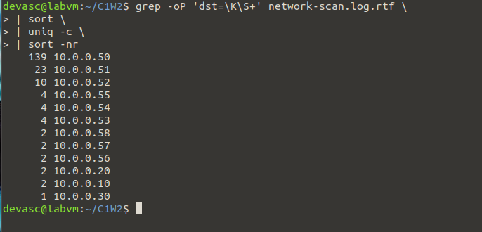
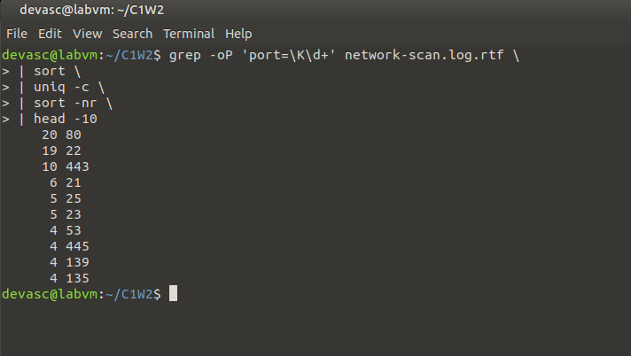

# Investigation Tasks
```
Scenario: You are a network security analyst who has just received suspicious log files from your organization's network infrastructure. Multiple security incidents may have occurred over the past week, and you need to analyze the logs to identify threats, document findings, and provide recommendations.

Your Mission: Use Linux command-line tools to analyze network logs, identify security incidents, and create a comprehensive security report.

Skills Focus: grep, awk, sed, sort, uniq, wc, file operations, text processing, cross-referencing data
```

------------------------------------------------------------------------------------------------------
------------------------------------------------------------------------------------------------------

## Task 1: Brute Force Attack Detection (30 points)
Objective: Find evidence of SSH brute force attacks
Requirements:

### 1. Identify IP addresses with more than 20 failed SSH login attempts

#### Task 1-1 screenshot


#### Task 1-1 shell output
```bash
devasc@labvm:~/C1W2$ grep "Failed password" ssh-auth.log.rtf > failed.log
devasc@labvm:~/C1W2$ awk '{print $11}' failed.log > failed_ips.txt
devasc@labvm:~/C1W2$ sort failed_ips.txt | uniq -c | sort -nr > failed_counts.txt
devasc@labvm:~/C1W2$ awk '$1 > 20 {print}' failed_counts.txt
     40 203.0.113.44
     36 185.220.101.5
     31 198.51.100.15

```

#### Task 1-1 overview
a. `grep "Failed password" ssh-auth.log.rtf > failed.log` uses `grep` to search the log file for lines that contain "Failed password". Puts them into `failed.log` for easier parsing

b. `awk '{print $11}' failed.log > failed_ips.txt` For each line in failed.log, prints the 11th column (the attacker’s IP address). Puts this column into `failed_ips.txt` for easier parsing


c. `sort failed_ips.txt | uniq -c | sort -nr > failed_counts.txt` 

-  `sort` all ips into `failed_ips.txt`  

- `uniq -c` collapses duplicates and counts how many times each IP appears, since right now our file just has all the ips in plain text listed over and over again each time.


- `sort -nr` sorts the counts in numeric reverse order (biggest first).

d. `awk '$1 > 20 {print}' failed_counts.txt` looks at the first column in failed_counts.txt and prints anything over 20 failed login attempts, then displays only those IPs.


So to recap we filter the logs down to failed logins, pull the attacker IPs, count the failed ips, then list the IPs that failed over 20 times


### 2. Find the top 5 most aggressive attackers by failed login count


#### Task 1-2 screenshot


#### Task 1-2 shell output

```bash
devasc@labvm:~/C1W2$ head -n 5 failed_counts.txt
     40 203.0.113.44
     36 185.220.101.5
     31 198.51.100.15
     20 198.51.100.25
```
#### Task 1-2 overview

`head -n 5 failed_counts.txt`, head -n will show the top 5 lines in the file `failed_counts.txt` but  since the ssh log only contains 4 IPs only 4 were listed. 


### 3. Determine the time period of the most intense attack activity

#### Task 1-3 screenshot


#### Task 1-3 shell output
```bash
devasc@labvm:~/C1W2$ grep "Failed password" ssh-auth.log.rtf | awk '{print $1,$2,substr($3,1,5)}' | sort | uniq -c
      5 Jan 15 08:15
      9 Jan 15 08:16
      9 Jan 15 08:17
      9 Jan 15 08:18
      8 Jan 15 08:19
     10 Jan 15 09:23
     12 Jan 15 09:24
      9 Jan 15 09:25
     11 Jan 15 14:45
     12 Jan 15 14:46
     12 Jan 15 14:47
      1 Jan 15 14:48
      6 Jan 15 15:30
     12 Jan 15 15:31
      2 Jan 15 15:32
devasc@labvm:~/C1W2$ 
```

#### Task 1-3 overview
  `grep "Failed password" ssh-auth.log.rtf | awk '{print $1,$2,substr($3,1,5)}' | sort | uniq -c`
 
- a. `grep "Failed password" ssh-auth.log.rtf` first looks at the `failed password` lines in the ssh log.
- b. `awk '{print $1,$2,substr($3,1,5)}'` we then pipe into a command to split each log into space seperated columns for monday day time (1,2,3) and create a substring from 3, where we only take the first 5 characters. For example 15:30, (HH:MM) including the semi colon.
- c. Lastly we pipe into a `sort` to sort minutes into order and `uniq -c` to collapse dupes.


### Task 1 Brute-force-report 

Three main attacker IPs exceeded 20 failed SSH attempts:
- `203.0.113.44` (40 attempts)
- `185.220.101.5` (36 attempts)
- `198.51.100.15` (31 attempts)

Top brute force activity came from these IPs, with repeated bursts of 8–12 failures per minute. 

The attacker made steady attempts in bursts, usually 8–12 tries per minute. The heaviest attack windows were:
- 09:24 (12 failures)
- 14:46–14:47 (12 failures each minute)
- 15:31 (12 failures)

------------------------------------------------------------------------------------------------------
------------------------------------------------------------------------------------------------------

## Task 2: Port Scanning Analysis (30 points)
Objective: Identify port scanning activities and their targets

Requirements:
### 1. Find IP addresses that scanned more than 40 different ports


####  Task 2-1 screenshot


####  Task 2-1 shell output

```bash
devasc@labvm:~/C1W2$ grep -oP 'src=\S+.*port=\d+' network-scan.log.rtf \
> | sort -u \
> | cut -d' ' -f1 \
> | sort \
> | uniq -c \
> | awk '$1>40'
     85 src=185.220.101.5
     53 src=198.51.100.15
devasc@labvm:~/C1W2$
```

####  Task 2-1 overview
- `grep -oP 'src=\S+.*port=\d+' network-scan.log.rtf \`: pulls "src=IP ... port=PORT" from each scan line
- `| sort -u \`                                           : de-duplicate (src,port) pairs
- `| cut -d' ' -f1 \`                                     : keep only the src=IP column
- `| sort \`                                              : sort IPs
- `| uniq -c \`                                           : count unique ports per src
- `| awk '$1>40' \`                                       : show only IPs with > 40 ports
- `| sort -nr`                                            : sort biggest scanners first


### 2. Identify which internal servers were most heavily scanned

#### Task 2-2 screenshot



#### Task 2-2 screenshot shell output
```bash
devasc@labvm:~/C1W2$ grep -oP 'dst=\K\S+' network-scan.log.rtf \
> | sort \
> | uniq -c \
> | sort -nr
    139 10.0.0.50
     23 10.0.0.51
     10 10.0.0.52
      4 10.0.0.55
      4 10.0.0.54
      4 10.0.0.53
      2 10.0.0.58
      2 10.0.0.57
      2 10.0.0.56
      2 10.0.0.20
      2 10.0.0.10
      1 10.0.0.30
devasc@labvm:~/C1W2$    

```
#### Task 2-2 screenshot overview

- `grep -oP 'dst=\K\S+' network-scan.log.rtf \` : extract only the dst=SERVER addresses per line via regex 
- `| sort \` : sorts so we can group identical servers together
- `| uniq -c \` : count how many times each server was scanned
- `| sort -nr`:  sort results numerically, biggest first


### 3. List the most commonly targeted ports

####  Task 2-3 screenshot 




#### Task 2-3 shell output
```bash
devasc@labvm:~/C1W2$ grep -oP 'port=\K\d+' network-scan.log.rtf \
> | sort \
> | uniq -c \
> | sort -nr \
> | head -10
     20 80
     19 22
     10 443
      6 21
      5 25
      5 23
      4 53
      4 445
      4 139
      4 135
```

#### Task 2-3 overview

* `grep -oP 'port=\K\d+' network-scan.log.rtf \` : extract only the port numbers from each line via regex
* `| sort \` : sorts so we can group identical port numbers together
* `| uniq -c \` : count how many times each port was scanned
* `| sort -nr \` : sort results numerically, biggest first
* `| head -10` : show only the **top 10 most scanned ports**


### Task 2 port-scan-analysis:

- The IP addresses that scanned more than 40 different ports were `src=185.220.101.5` with `85` ports scanned. and `src=198.51.100.15` with `53`. 

- The 3 most scanned internal servers had the following ips `10.0.0.50` 139 times, `10.0.0.51` 23 times and `10.0.0.52` 10 times.

- `port 80` with 20 scans, `port 22` with 19 scans and `port 443` with 10 commands were the top 3 most scanned ports.


------------------------------------------------------------------------------------------------------
------------------------------------------------------------------------------------------------------


## Task 3: Correlation Analysis (40 points)
Objective: Connect incidents across multiple log sources
Requirements:

1. Find IP addresses that appear in multiple log files (cross-reference attackers)
2. Create a timeline of coordinated attack activities

- Commands you'll need: grep -f, comm, join, sort, file redirection, awk
- Deliverable: Screenshot of commands and a text summary in a-named 3. Correlation-report

#### Task 3. correlation-report

