# M3 Assignment - Angel Santoyo

The goal here is to create a master control VM to push down policies and security baselines to two VMs via SSH with Python, check compliance, and set up some automation.

This assignment was completed in my **Proxmox-based homelab environment**: [https://github.com/anguzz/homelab](https://github.com/anguzz/homelab)

<p align="center">
  
</p>

### **Step 1: Environment Setup**

To start out, I created the `ubuntu-24.04.2-live-server-amd64.iso` VMs on my Proxmox host’s local file storage. This ISO baseline was used for all three nodes. After uploading the ISO, I created the following VMs in **Proxmox (pve2)**:

* **VM1 = Control-Station** – ID 107
* **VM2 = Target1** – ID 108
* **VM3 = Target2** – ID 109


#### **VM Specs (per assignment guidelines)**

* **VM1 (Control-Station)**

  * vCPU: 2 cores
  * Memory: 2 GB
  * Disk: 20 GB
  * User: `angel` / `******`
  * Hostname: `control-station`

* **VM2 (Target1)**

  * vCPU: 1–2 cores (set 2)
  * Memory: 2 GB
  * Disk: 20 GB
  * User: `audituser` / `AuditPass123`
  * Hostname: `target1`

* **VM3 (Target2)**

  * vCPU: 1–2 cores (set 2)
  * Memory: 2 GB
  * Disk: 20 GB
  * User: `audituser` / `AuditPass123`
  * Hostname: `target2`


#### **Networking**

All VMs are attached to the same Proxmox bridge:

* **Bridge:** `vmbr0`
* **Gateway:** `192.168.1.254` (AT&T router)
* **DNS:** `1.1.1.1, 8.8.8.8`

Static IPs assigned at install time:

* VM1 → `192.168.1.201`
* VM2 → `192.168.1.202`
* VM3 → `192.168.1.203`

**Expected Result:** Virtual environment created with required libraries installed.
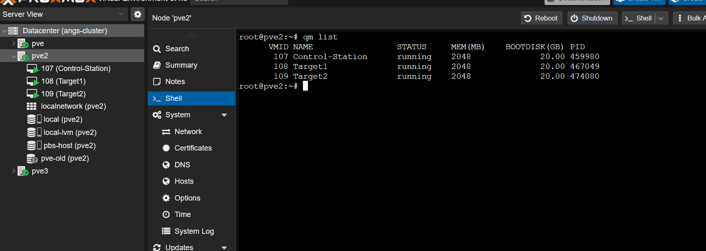


### **Step 2: VM Setup**

#### VM 1 Control-Station 
I ran the required commands succesfully to setup VM1 Control-station. 

```bash
# Install SSH server
sudo apt update
sudo apt install openssh-server -y

# Start and enable SSH service
sudo systemctl start ssh
sudo systemctl enable ssh

# Create a test user for SSH access
sudo useradd -m -s /bin/bash audituser
echo "audituser:AuditPass123" | sudo chpasswd

# Grant sudo privileges (for config access)
echo "audituser ALL=(ALL) NOPASSWD:ALL" | sudo tee /etc/sudoers.d/audituser

# Verify SSH is running
sudo systemctl status ssh
```

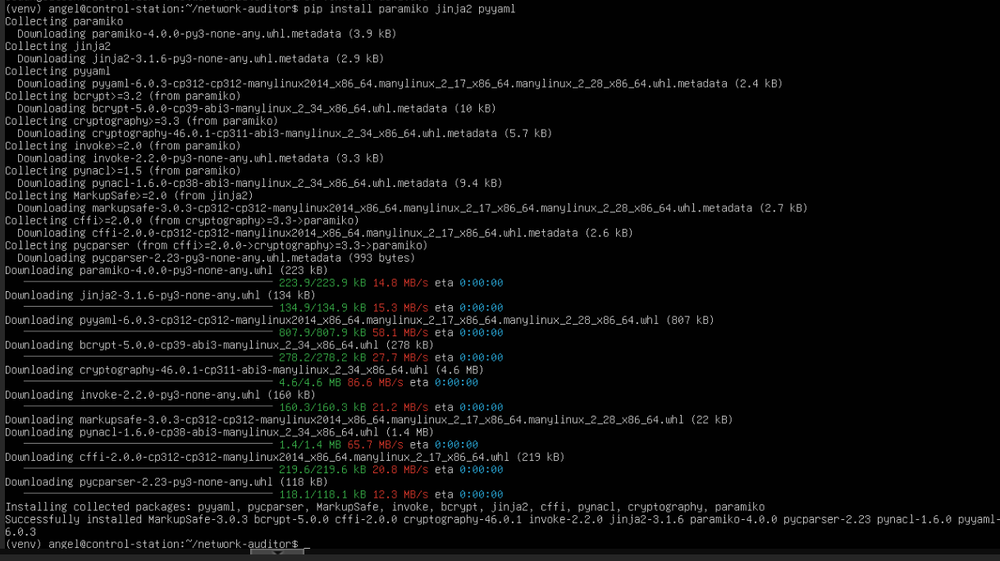

#### VM 2 Target1

- I setup vm2 by running `sudo apt update`
- I installed it openssh as a requirement during the VMs setup as can be seen with the command below.

`dpkg -l | grep openssh-server` 

- After this i ran the commands to ensure ssh is running an enabled as a startup command and verified its running.

```bash
sudo systemctl start ssh
sudo systemctl enable ssh
sudo systemctl status ssh
```

There was also no need to setup the audituser since that is the default user on this server that was setup during time with sudo privileges. As seen in the screenshot this user is running sudo commands and the current signed in user with `whoami`

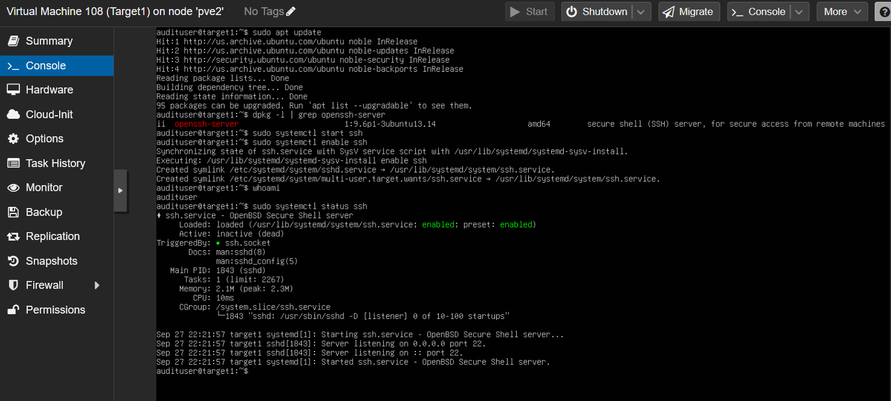

#### VM 3 Target2 

I ran the same subset of commands on VM3 to showcase active ssh status, and the required audituser with sudo privileges. 

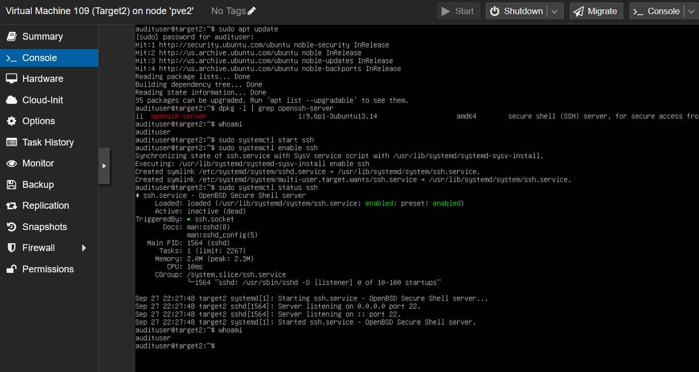


### Step 3: Test SSH Connectivity from VM1

#### SSH Connectivity to Target1
From the control-station I ran `ssh audituser@192.168.1.202` and was able to succesfully connect.

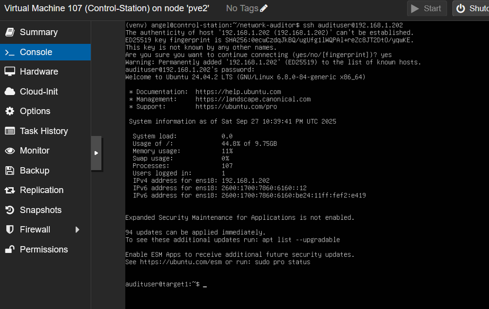

#### SSH Connectivity to Target2

From the control-station I ran `ssh audituser@192.168.1.203` and was able to succesfully connect.
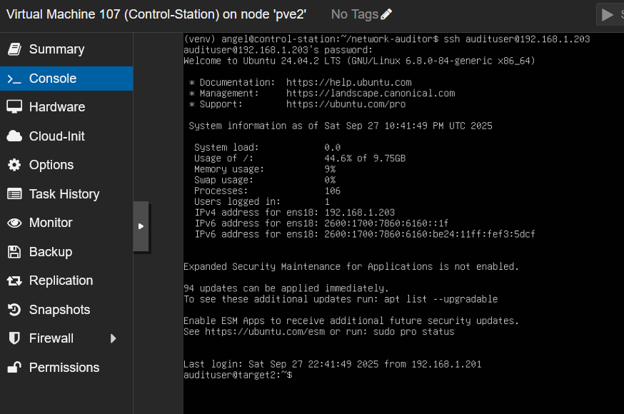

### Step 4: Create Project Directory Structure on VM1

On the controller I was able to create the required directory structure with `mkdir -p baselines configs reports`

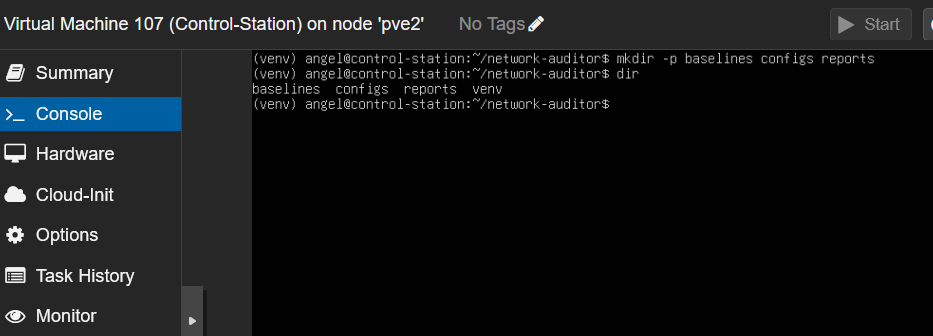

### Step 5: Create Baseline Configuration Files on VM1

Since proxmox console does not allow clipboard I had to enable ssh on the control-station to paste the config file through ssh via the pve console over ssh.


I enabled ssh on the controller host via 

```bash
sudo systemctl start ssh
sudo systemctl enable ssh
sudo systemctl status ssh
```
Then connected with `ssh angel@192.168.1.201`.

#### File 1: SSH Security Baseline

I was able to configure the SSH baseline on the host with `nano ~/network-auditor/baselines/ssh_baseline.yaml` 

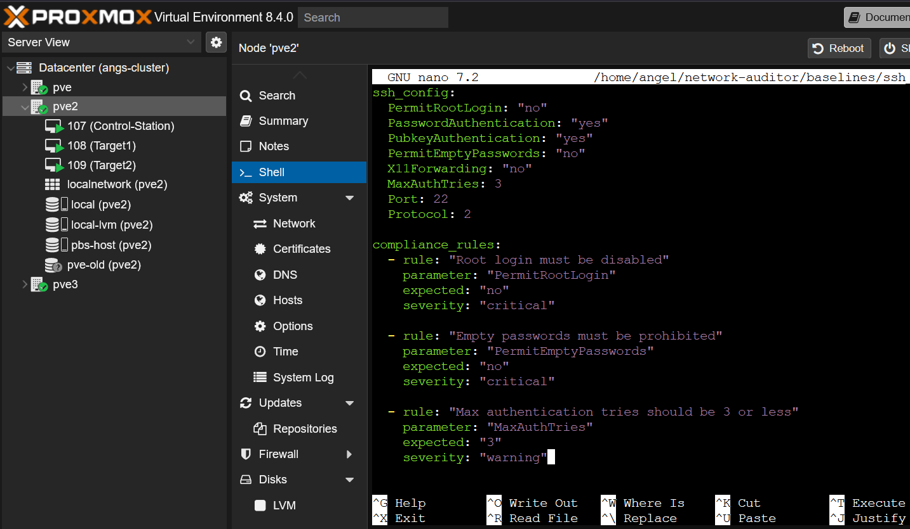


#### File 2: Firewall Security Baseline

I was able to configure the Firewall baseline on the host with `nano ~/network-auditor/baselines/firewall_baseline.yaml`

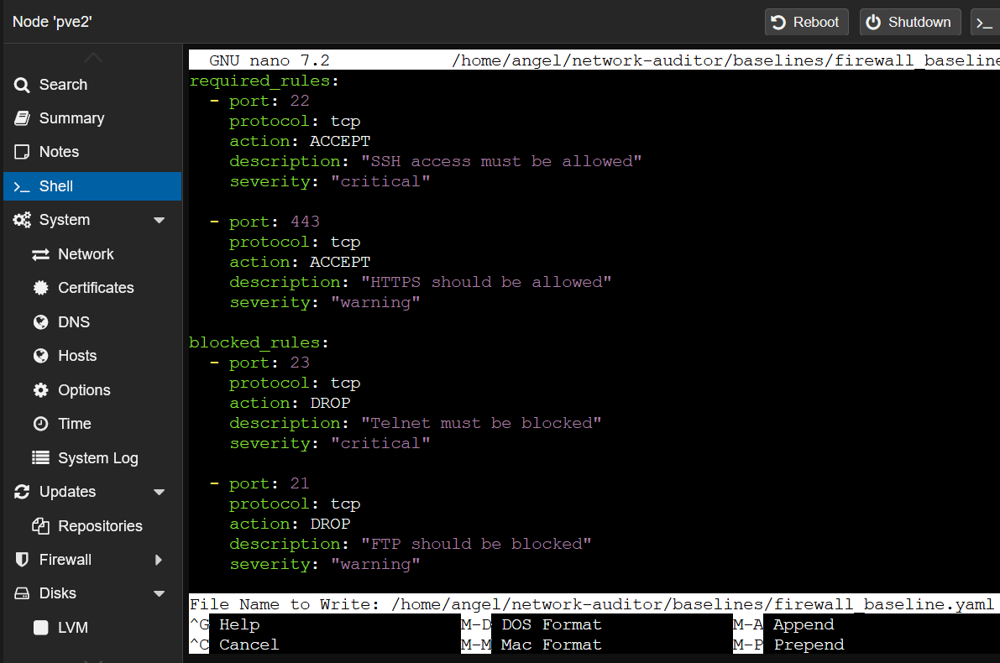

#### File 3: User Account Security Baseline

I was able to configure the User Account baseline on the host with `nano ~/network-auditor/baselines/users_baseline.yaml`

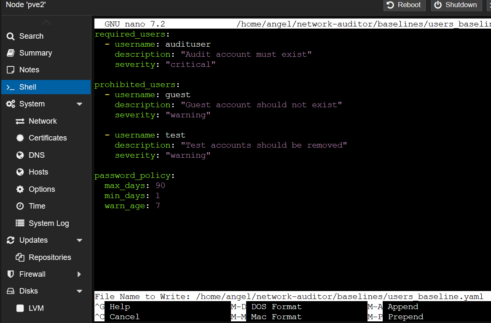

**Expected Result:** Three baseline YAML files created in `~/network-auditor/baselines/`.
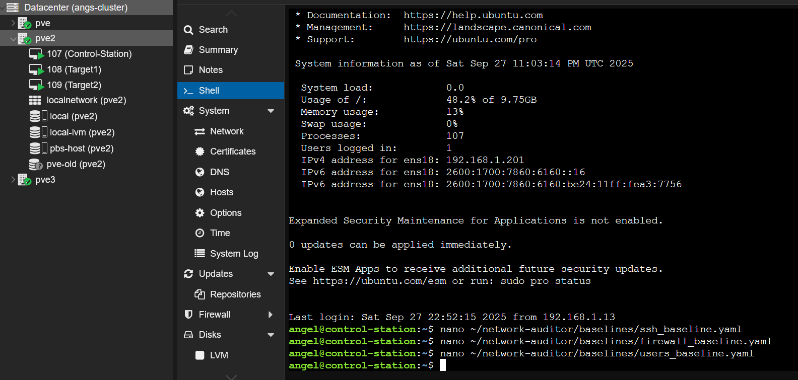

### Step 6: Create Device Inventory File on VM1

I modified the yaml with my VM2 and VM3 respective IPs and configured it with  `nano ~/network-auditor/device_inventory.yaml`

**Expected Result:** Inventory file created at `~/network-auditor/device_inventory.yaml`.

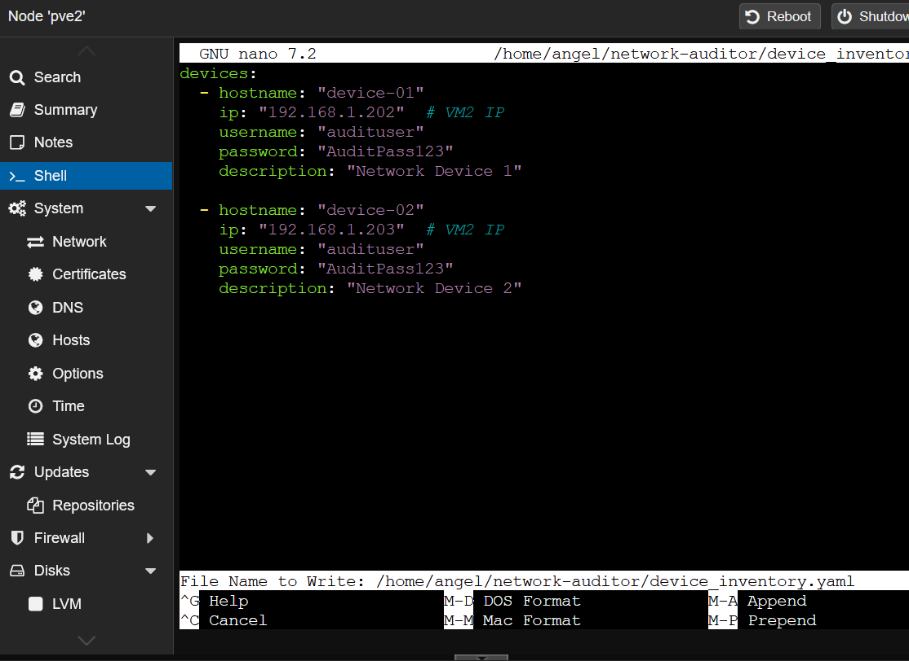


### Step 7: Verify Your Setup

I verified my setup the following commands succesfully. 

```bash
cd ~/network-auditor
ls -la
ls baselines/
source venv/bin/activate
pip list | grep paramiko
```

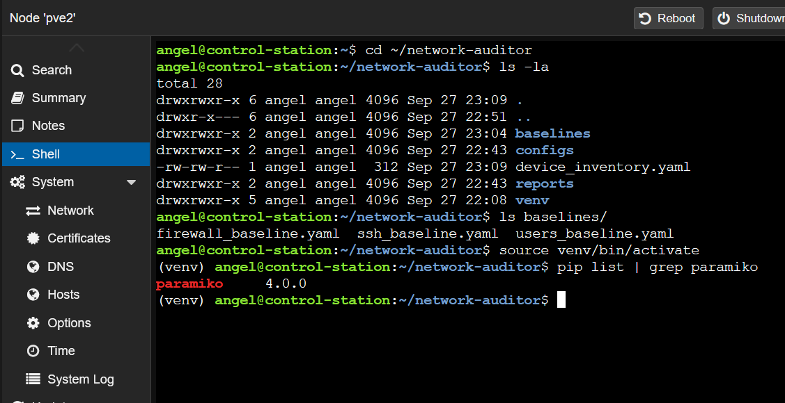


### Step 8: Introduce Configuration Violations

#### Target 1 Configuration violations

I applied all config violations to the first target then restarted the ssh service in a batch. 

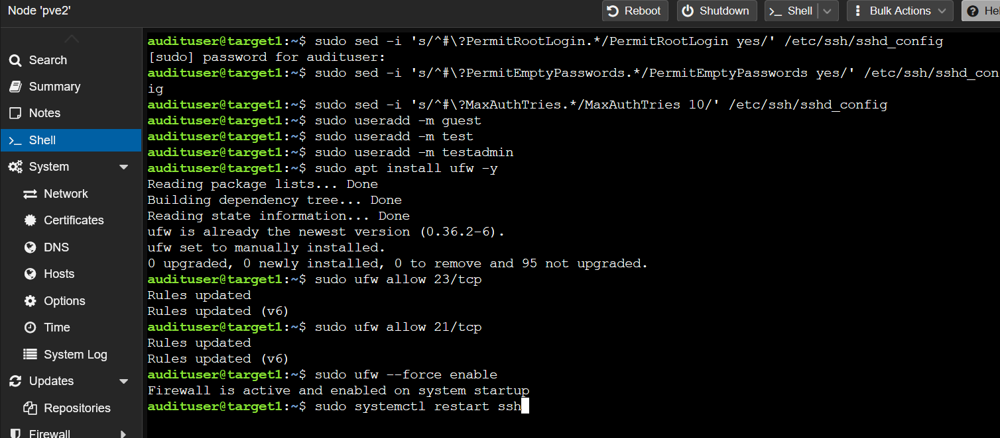


#### Target 2 Configuration violations

I applied all config violations to the second target then restarted the ssh service in a batch. 

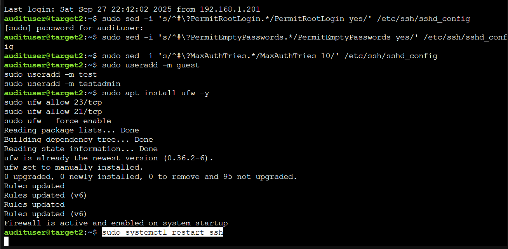

#### Control station violation documenation. 
Back on the controller I documented the changes with `nano ~/network-auditor/violations_introduced.txt`

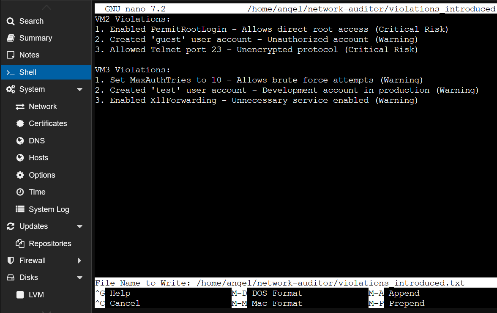


### Step 9: Build the Auditor Script with GenAI Assistance

Create `~/network-auditor/auditor.py`.
I ran the following commands to activate my python virtual enviromenet and create the auditor.py file.
```bash
cd ~/network-auditor
source venv/bin/activate
nano auditor.py
python3 auditor.py 
```
then created and ran auditor.py file. 

This was the following shell output.

```bash
(venv) angel@control-station:~/network-auditor$ python3 auditor.py

[+] Connecting to device-01 (192.168.1.202) as audituser ...
target1
 23:36:19 up  1:50,  2 users,  load average: 0.00, 0.00, 0.00
/home/angel/network-auditor/auditor.py:306: DeprecationWarning: datetime.datetime.utcnow() is deprecated and scheduled for removal in a future version. Use timezone-aware objects to represent datetimes in UTC: datetime.datetime.now(datetime.UTC).
  ts = datetime.utcnow().strftime("%Y%m%dT%H%M%SZ")

=== Audit Summary: device-01 (192.168.1.202) ===
Security Score: 35/100
Critical: 3 | Warning: 4
Violations:
 - [CRITICAL] ssh: Root login must be disabled
    Expected: no | Actual: yes
    Remediation: Set PermitRootLogin to no in /etc/ssh/sshd_config and restart sshd (sudo systemctl restart ssh).
 - [CRITICAL] ssh: Empty passwords must be prohibited
    Expected: no | Actual: yes
    Remediation: Set PermitEmptyPasswords to no in /etc/ssh/sshd_config and restart sshd (sudo systemctl restart ssh).
 - [WARNING] ssh: Max authentication tries should be 3 or less
    Expected: 3 | Actual: 10
    Remediation: Set MaxAuthTries to 3 in /etc/ssh/sshd_config and restart sshd (sudo systemctl restart ssh).
 - [WARNING] users: Prohibited user 'guest' must not exist
    Expected: user 'guest' absent | Actual: present
    Remediation: Remove the prohibited user: sudo userdel -r guest
 - [WARNING] users: Prohibited user 'test' must not exist
    Expected: user 'test' absent | Actual: present
    Remediation: Remove the prohibited user: sudo userdel -r test
 - [CRITICAL] firewall: SSH access must be allowed
    Expected: ALLOW | Actual: missing
    Remediation: sudo ufw allow 22/tcp
 - [WARNING] firewall: HTTPS should be allowed
    Expected: ALLOW | Actual: missing
    Remediation: sudo ufw allow 443/tcp
Saved JSON report: /home/angel/network-auditor/reports/report_device-01_20250927T233619Z.json

[+] Connecting to device-02 (192.168.1.203) as audituser ...
target2
 23:36:20 up  1:35,  2 users,  load average: 0.00, 0.00, 0.00

=== Audit Summary: device-02 (192.168.1.203) ===
Security Score: 35/100
Critical: 3 | Warning: 4
Violations:
 - [CRITICAL] ssh: Root login must be disabled
    Expected: no | Actual: yes
    Remediation: Set PermitRootLogin to no in /etc/ssh/sshd_config and restart sshd (sudo systemctl restart ssh).
 - [CRITICAL] ssh: Empty passwords must be prohibited
    Expected: no | Actual: yes
    Remediation: Set PermitEmptyPasswords to no in /etc/ssh/sshd_config and restart sshd (sudo systemctl restart ssh).
 - [WARNING] ssh: Max authentication tries should be 3 or less
    Expected: 3 | Actual: 10
    Remediation: Set MaxAuthTries to 3 in /etc/ssh/sshd_config and restart sshd (sudo systemctl restart ssh).
 - [WARNING] users: Prohibited user 'guest' must not exist
    Expected: user 'guest' absent | Actual: present
    Remediation: Remove the prohibited user: sudo userdel -r guest
 - [WARNING] users: Prohibited user 'test' must not exist
    Expected: user 'test' absent | Actual: present
    Remediation: Remove the prohibited user: sudo userdel -r test
 - [CRITICAL] firewall: SSH access must be allowed
    Expected: ALLOW | Actual: missing
    Remediation: sudo ufw allow 22/tcp
 - [WARNING] firewall: HTTPS should be allowed
    Expected: ALLOW | Actual: missing
    Remediation: sudo ufw allow 443/tcp
Saved JSON report: /home/angel/network-auditor/reports/report_device-02_20250927T233620Z.json
```

Followed by the JSON report.

```json
(venv) angel@control-station:~/network-auditor$ cat /home/angel/network-auditor/reports/report_device-02_20250927T233620Z.json
{
  "generated_at_utc": "20250927T233620Z",
  "device": {
    "hostname": "device-02",
    "ip": "192.168.1.203",
    "description": "Network Device 2"
  },
  "extracted": {
    "users_count": 37,
    "ufw_rules_count": 0
  },
  "violations_grouped": {
    "critical": [
      {
        "category": "ssh",
        "rule": "Root login must be disabled",
        "parameter": "PermitRootLogin",
        "expected": "no",
        "actual": "yes",
        "severity": "critical",
        "recommendation": "Set PermitRootLogin to no in /etc/ssh/sshd_config and restart sshd (sudo systemctl restart ssh)."
      },
      {
        "category": "ssh",
        "rule": "Empty passwords must be prohibited",
        "parameter": "PermitEmptyPasswords",
        "expected": "no",
        "actual": "yes",
        "severity": "critical",
        "recommendation": "Set PermitEmptyPasswords to no in /etc/ssh/sshd_config and restart sshd (sudo systemctl restart ssh)."
      },
      {
        "category": "firewall",
        "rule": "SSH access must be allowed",
        "parameter": "ufw 22/tcp",
        "expected": "ALLOW",
        "actual": "missing",
        "severity": "critical",
        "recommendation": "sudo ufw allow 22/tcp"
      }
    ],
    "warning": [
      {
        "category": "ssh",
        "rule": "Max authentication tries should be 3 or less",
        "parameter": "MaxAuthTries",
        "expected": "3",
        "actual": "10",
        "severity": "warning",
        "recommendation": "Set MaxAuthTries to 3 in /etc/ssh/sshd_config and restart sshd (sudo systemctl restart ssh)."
      },
      {
        "category": "users",
        "rule": "Prohibited user 'guest' must not exist",
        "parameter": "user_absence",
        "expected": "user 'guest' absent",
        "actual": "present",
        "severity": "warning",
        "recommendation": "Remove the prohibited user: sudo userdel -r guest"
      },
      {
        "category": "users",
        "rule": "Prohibited user 'test' must not exist",
        "parameter": "user_absence",
        "expected": "user 'test' absent",
        "actual": "present",
        "severity": "warning",
        "recommendation": "Remove the prohibited user: sudo userdel -r test"
      },
      {
        "category": "firewall",
        "rule": "HTTPS should be allowed",
        "parameter": "ufw 443/tcp",
        "expected": "ALLOW",
        "actual": "missing",
        "severity": "warning",
        "recommendation": "sudo ufw allow 443/tcp"
      }
    ]
  },
  "security_score": 35,
  "violations": [
    {
      "category": "ssh",
      "rule": "Root login must be disabled",
      "parameter": "PermitRootLogin",
      "expected": "no",
      "actual": "yes",
      "severity": "critical",
      "recommendation": "Set PermitRootLogin to no in /etc/ssh/sshd_config and restart sshd (sudo systemctl restart ssh)."
    },
    {
      "category": "ssh",
      "rule": "Empty passwords must be prohibited",
      "parameter": "PermitEmptyPasswords",
      "expected": "no",
      "actual": "yes",
      "severity": "critical",
      "recommendation": "Set PermitEmptyPasswords to no in /etc/ssh/sshd_config and restart sshd (sudo systemctl restart ssh)."
    },
    {
      "category": "ssh",
      "rule": "Max authentication tries should be 3 or less",
      "parameter": "MaxAuthTries",
      "expected": "3",
      "actual": "10",
      "severity": "warning",
      "recommendation": "Set MaxAuthTries to 3 in /etc/ssh/sshd_config and restart sshd (sudo systemctl restart ssh)."
    },
    {
      "category": "users",
      "rule": "Prohibited user 'guest' must not exist",
      "parameter": "user_absence",
      "expected": "user 'guest' absent",
      "actual": "present",
      "severity": "warning",
      "recommendation": "Remove the prohibited user: sudo userdel -r guest"
    },
    {
      "category": "users",
      "rule": "Prohibited user 'test' must not exist",
      "parameter": "user_absence",
      "expected": "user 'test' absent",
      "actual": "present",
      "severity": "warning",
      "recommendation": "Remove the prohibited user: sudo userdel -r test"
    },
    {
      "category": "firewall",
      "rule": "SSH access must be allowed",
      "parameter": "ufw 22/tcp",
      "expected": "ALLOW",
      "actual": "missing",
      "severity": "critical",
      "recommendation": "sudo ufw allow 22/tcp"
    },
    {
      "category": "firewall",
      "rule": "HTTPS should be allowed",
      "parameter": "ufw 443/tcp",
      "expected": "ALLOW",
      "actual": "missing",
      "severity": "warning",
      "recommendation": "sudo ufw allow 443/tcp"
    }
  ]
}
```

# Auditor.py screenshots.

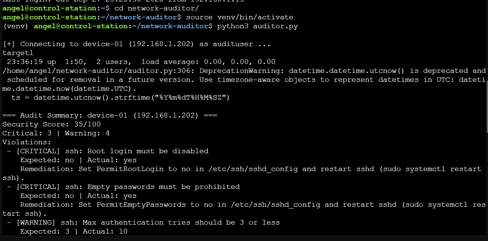
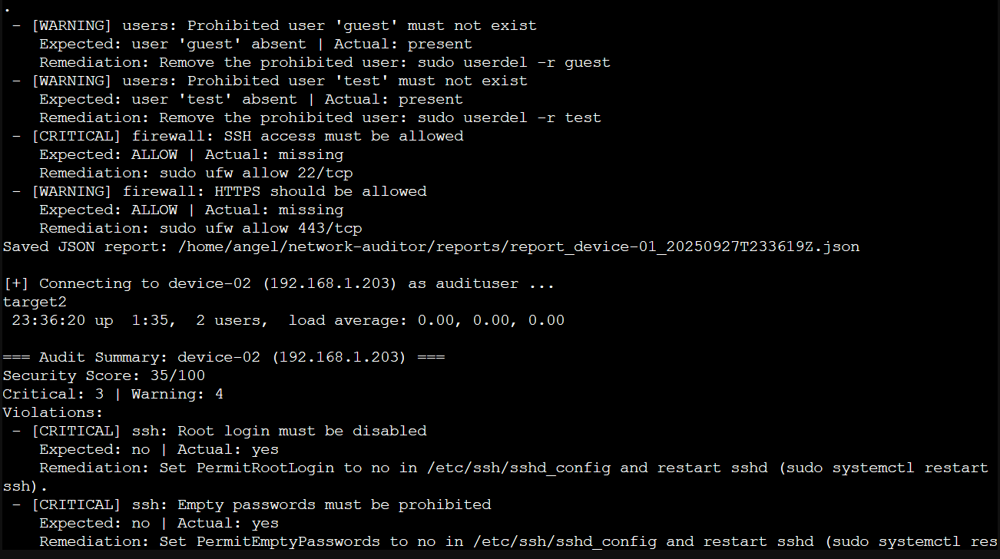
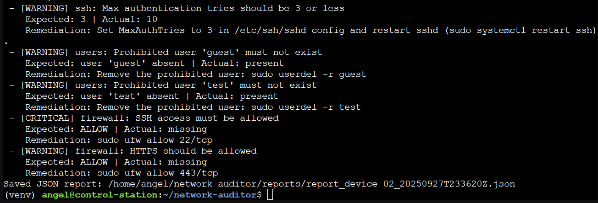

# Delivarables

* [x] All 3 VMs configured and communicating
* [x] SSH connections working from VM1 → VM2/VM3
* [x] Baseline YAML files created correctly
* [x] Device inventory contains correct IPs
* [x] At least 6 violations introduced (3 per VM)
* [x] Python script runs without errors
* [x] Violations detected correctly
* [x] Security scores calculated correctly
* [x] Report clearly shows violations + remediation steps
* [x] JSON report saved to `reports/`
* [x] All screenshots captured and labeled
