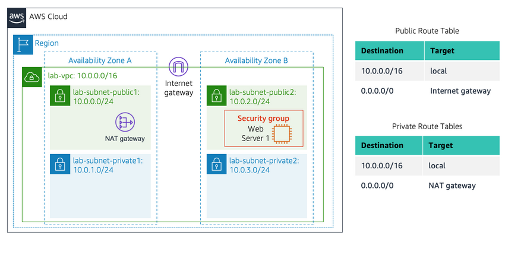

#  AWS Lab 2: Build your VPC and Launch a Web Server

## Overview
This lab focused on **Amazon Virtual Private Cloud (VPC)**, the foundational networking service of AWS. I designed and implemented a custom virtual network across multiple Availability Zones, configured secure routing, and deployed a functional web server within that infrastructure.

## Objectives
*   **Architect** a custom VPC with public and private isolation.
*   **Implement** High Availability by spanning subnets across multiple Availability Zones.
*   **Configure** Routing Tables and Internet Gateways (IGW) for external connectivity.
*   **Secure** resources using stateful Security Groups.
*   **Bootstrap** an EC2 instance using User Data scripts to automate web server deployment.



---

##  Detailed Architecture & Setup

### 1. Networking Infrastructure (VPC & Subnetting)
The foundation was built using a `/16` CIDR block, providing a private IP space that was then segmented for organizational and security purposes.

*   **VPC Design:** Created `lab-vpc` with a CIDR of `10.0.0.0/16`.
*   **Subnet Segmentation:** Created four `/24` subnets (254 usable IPs each). By spreading these across **Availability Zones (us-east-1a and us-east-1b)**, the architecture ensures that a single data center failure does not take down the entire application.
*   **The "Public" Distinction:** A subnet is technically "public" only because its **Route Table** is configured to send non-local traffic (`0.0.0.0/0`) to the Internet Gateway.


### 2. Connectivity & Routing Logic
Routing tables were updated to dictate exactly how traffic enters and exits the network:

*   **Internet Gateway (IGW):** Attached `lab-igw` to the VPC to provide a target for internet-bound traffic.
*   **NAT Gateway:** Deployed `lab-nat-public1` in a public subnet. This acts as a managed proxy, allowing instances in **Private Subnets** to pull OS updates from the internet without allowing the internet to initiate a direct connection to them.
*   **Route Table Associations:** 
    *   **Public Route Table:** `0.0.0.0/0` → `IGW`. Associated with `public1` and `public2`.
    *   **Private Route Table:** `0.0.0.0/0` → `NAT Gateway`. Associated with `private1` and `private2`.


### 3. Security Framework (Security Groups)
I implemented a **Security Group** named `Web Security Group` to act as a stateful host-level firewall.
*   **Inbound Rule:** Allowed **HTTP (Port 80)** from `0.0.0.0/0`.
*   **Stateful Nature:** Because Security Groups are stateful, allowing the inbound request automatically permits the outbound response, regardless of outbound rules.

---

##  Compute & Automation

### 4. EC2 Web Server Deployment
I launched an **Amazon Linux 2023** `t2.micro` instance into the `lab-subnet-public2` subnet. To ensure the server was functional immediately upon boot, I used **User Data** to automate the setup.

**Bootstrap Script (User Data):**
The script runs as `root` during the initial boot process (via `cloud-init`):
```bash
#!/bin/bash
# 1. Install the LAMP stack (Linux, Apache, PHP, MariaDB)
dnf install -y httpd wget php mariadb105-server

# 2. Download and deploy the web application code
wget https://aws-tc-largeobjects.s3.us-west-2.amazonaws.com/CUR-TF-100-ACCLFO-2/2-lab2-vpc/s3/lab-app.zip
unzip lab-app.zip -d /var/www/html/

# 3. Configure the Apache service to persist across reboots and start now
chkconfig httpd on
service httpd start
```

---

##  Outcomes & Verification
*   **Final Score:** 30/30
*   **Validation:** Verified connectivity by browsing to the **Public IPv4 DNS**. The page successfully loaded, displaying instance metadata (retrieved via the link-local address `169.254.169.254`).
*   **Key Insight:** This lab demonstrated that cloud networking is a software-defined version of traditional data center networking, where "hardware" like routers and firewalls are managed through AWS Route Tables and Security Groups.

