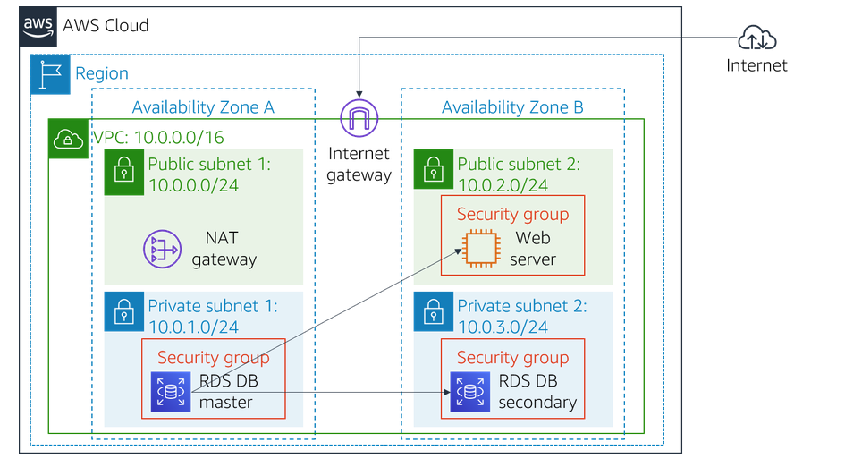

# AWS Lab 5: Build Your DB Server and Interact With Your DB Using an App

## Overview
This lab focused on leveraging **Amazon Relational Database Service (RDS)** to deploy a highly available database backend. I transitioned from a single-tier architecture to a multi-tier infrastructure by provisioning a managed MySQL instance, configuring secure network communication between the web and database layers, and validating data persistence through a live "Address Book" application.

## Objectives
*   **Provision** a Multi-AZ Amazon RDS MySQL database instance.
*   **Secure** the database tier by creating specific VPC Security Groups with least-privilege access.
*   **Configure** a DB Subnet Group to define the network boundaries for high availability.
*   **Integrate** a web application with the RDS endpoint to perform CRUD (Create, Read, Update, Delete) operations.

---

## Technical Implementation Details

### 1. Network Security & Infrastructure
I established a secure communication path by nesting security groups and defining multi-zone subnets.
*   **Security Group:** Created `DB Security Group` and added an inbound rule for **MySQL (Port 3306)**. The source was restricted specifically to the `Web Security Group`.
*   **High Availability:** Defined a `DB Subnet Group` spanning two Availability Zones (`us-east-1a` and `us-east-1b`) to support the Multi-AZ deployment.

### 2. Database Provisioning
I launched a managed MySQL instance with the following specifications to balance performance and reliability for the lab scenario:

| Setting | Configuration Value |
| :--- | :--- |
| **Engine** | MySQL (Dev/Test Template) |
| **Deployment** | Multi-AZ DB Instance |
| **Instance Class** | `db.t3.micro` (Burstable) |
| **Storage** | 20 GiB General Purpose SSD (gp2) |
| **Database Name** | `lab` |
| **Connectivity** | Associated with `Lab VPC` and `DB Security Group` |

---

## Application Interaction & Data Flow

### 3. Connecting the Web Tier to the Data Tier
Once the RDS instance reached the **Available** state, I retrieved the unique DNS **Endpoint** to link the application.

**Connection Parameters used in the Web UI:**
*   **Endpoint:** `lab-db.xxxx.us-east-1.rds.amazonaws.com`
*   **Database:** `lab`
*   **User:** `main`
*   **Password:** `lab-password`

### 4. Verification of Persistence
I accessed the web application via the `WebServer` public IP and performed the following:
1.  Connected the app to the RDS instance using the endpoint.
2.  Populated the **Address Book** with contact entries.
3.  Verified that data remained persistent across sessions, confirming that the web server was successfully communicating with the managed RDS backend.

---

## Outcomes & Key Learnings
*   **Final Score:** 100%
*   **Managed Service Benefits:** Experienced how Amazon RDS automates time-consuming tasks like hardware provisioning, database setup, and synchronous data replication.
*   **High Availability (HA):** Demonstrated how Multi-AZ deployments provide data redundancy and failover support by automatically replicating data to a standby instance.
*   **Tiered Security:** Reinforced the best practice of "Security in Depth" by ensuring the database is not publicly accessible and only accepts traffic from the authorized web tier.