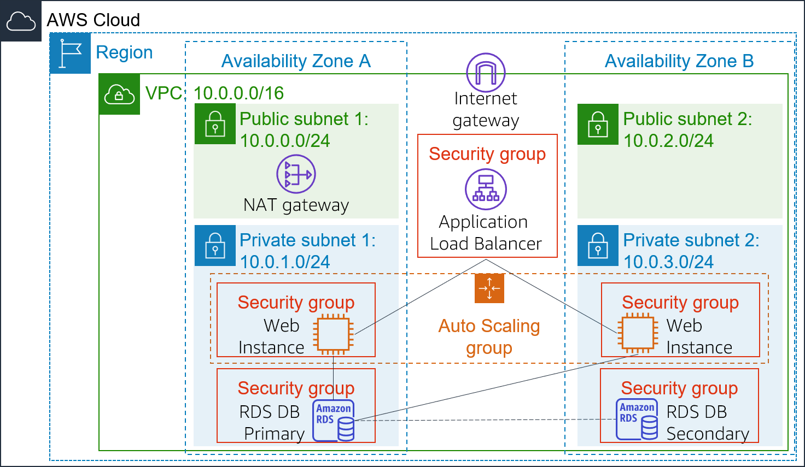

# Lab 6: Scale and Load Balance Your Architecture

## Overview
This lab focused on transforming a static single-server architecture into a **highly available, scalable, and fault-tolerant** system. By utilizing **Elastic Load Balancing (ELB)** and **EC2 Auto Scaling**, I configured the infrastructure to automatically adjust to traffic demands while ensuring that the application remains accessible even if individual instances fail.

## Objectives
*   **Capture** a golden image by creating an Amazon Machine Image (AMI) from a running instance.
*   **Distribute** traffic across multiple instances using an Application Load Balancer.
*   **Automate** resource provisioning with Launch Templates and Auto Scaling Groups.
*   **Implement** self-healing and performance-based scaling using CloudWatch Alarms.

---

## Technical Implementation Details

### 1. Image Creation (AMI)
To ensure all new instances launched by Auto Scaling were identical to the original, I created a "Golden Image":
*   **Source:** Web Server 1.
*   **Artifact:** `WebServerAMI`.
*   **Purpose:** This saved the OS, configurations, and application code into a reusable template.

### 2. Load Balancing Infrastructure
I deployed an **Application Load Balancer (ALB)** to act as the single point of entry for users.
*   **Target Group:** Created `LabGroup` to manage the pool of EC2 instances.
*   **Listener:** Configured to listen on **HTTP (Port 80)**.
*   **Network:** Configured for **Public Subnets 1 & 2** to ensure the entry point was internet-facing across multiple Availability Zones.

### 3. Auto Scaling Configuration
I established the logic for how the fleet should grow and shrink:
*   **Launch Template:** Defined `LabConfig`, specifying the `t2.micro` instance type, security groups, and the `WebServerAMI`.
*   **Placement:** Instances were launched into **Private Subnets** to ensure the web servers were not directly accessible from the internet (enhancing security).
*   **Scaling Policy:** 
    *   **Desired Capacity:** 2 instances.
    *   **Scaling Limit:** Minimum of 2, Maximum of 6.
    *   **Metric:** Target tracking policy based on **Average CPU Utilization at 60%**.

---

## Performance Testing & Results

### 4. Load Testing and Auto Scaling
To verify the automation, I triggered a manual load test through the web application:
1.  **Baseline:** The system started with **2 instances** (the minimum).
2.  **Stress Test:** The "Load Test" script pushed CPU utilization above the 60% threshold.
3.  **CloudWatch Alarm:** The `AlarmHigh` state was triggered once the threshold was sustained.
4.  **Scaling Event:** Auto Scaling automatically provisioned a 3rd (and potentially more) `Lab Instance` to handle the surge.

### 5. Fault Tolerance & Cleanup
*   **Verification:** Accessed the application via the **ALB DNS Name**, confirming traffic was successfully routed to healthy targets in the private subnets.
*   **Finalization:** Terminated the original `Web Server 1` to prove that the architecture was now independent of the initial setup and fully managed by the Auto Scaling group.

---

## Outcomes & Key Learnings
*   **High Availability:** By spreading instances across multiple Availability Zones, the application can survive the failure of a single data center.
*   **Cost Optimization:** Auto Scaling ensures we only pay for the capacity we need by scaling in (removing instances) during low-traffic periods.
*   **Operational Excellence:** Using Launch Templates and AMIs allows for "Infrastructure as Code" principles, making deployments repeatable and less prone to human error.
