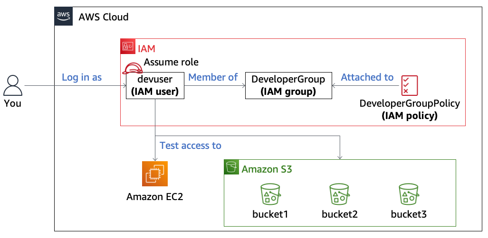

# AWS Lab: S3 Access Control with IAM Roles & Bucket Policies

## Overview
This lab focused on how **IAM identity-based policies** and **S3 resource-based policies (bucket policies)** work together to control access. The key takeaway was understanding how permissions can come from multiple sources and how **role assumption (STS)** changes your effective permissions.



## Objectives
* Understand the difference between **IAM policies vs bucket policies**
* Learn how to **assume roles** to gain temporary permissions
* Analyze how **S3 access is granted across buckets**
* Identify how **resource-based policies override or grant access**
* Troubleshoot access denied errors using policy analysis

---

## Key Concepts

### Identity-Based Policy (IAM)
- Attached to users or roles
- Defines **what actions you can perform**
- Example: `DeveloperGroupPolicy`

### Resource-Based Policy (S3 Bucket Policy)
- Attached directly to a resource (bucket)
- Defines **who can access the resource**
- Can grant access even if IAM policy doesn’t

### Role Assumption (STS)
- Allows a user to temporarily become a role
- Permissions are **replaced**, not combined

---

## Initial Access Behavior

### As `devuser`
* Could:
  - View some S3 bucket metadata
  - Create new buckets
* Could NOT:
  - Download objects
  - Upload objects
  - View bucket policies

Reason:
- No `s3:GetObject` or `s3:PutObject` permissions

---

## Bucket 1 Access (Role-Based)

### IAM Policy (BucketsAccessRole)

```json
{
    "Version": "2012-10-17",
    "Statement": [
        {
            "Action": [
                "s3:GetObject",
                "s3:ListObjects",
                "s3:ListBucket"
            ],
            "Resource": [
                "arn:aws:s3:::c196536a5037733l14948936t1w847482273275-bucket1-fm7du2undxnm",
                "arn:aws:s3:::c196536a5037733l14948936t1w847482273275-bucket1-fm7du2undxnm/*"
            ],
            "Effect": "Allow"
        }
    ]
}
```

### Result

* After assuming `BucketsAccessRole`:

  *  Able to **download from bucket1**
  *  Cannot upload (no `PutObject`)

---

## Trust Relationship (Role Assumption)

```json
{
    "Version": "2012-10-17",
    "Statement": [
        {
            "Effect": "Allow",
            "Principal": {
                "AWS": "arn:aws:iam::847482273275:user/devuser"
            },
            "Action": "sts:AssumeRole"
        }
    ]
}
```

### Meaning

* `devuser` is allowed to assume `BucketsAccessRole`
* This enables temporary elevated access

---

## Bucket 2 Access (Resource-Based Policy)

```json
{
    "Version": "2008-10-17",
    "Statement": [
        {
            "Sid": "S3Write",
            "Effect": "Allow",
            "Principal": {
                "AWS": "arn:aws:iam::847482273275:role/BucketsAccessRole"
            },
            "Action": [
                "s3:GetObject",
                "s3:PutObject"
            ],
            "Resource": "arn:aws:s3:::c196536a5037733l14948936t1w847482273275-bucket2-lllatuvqytw2/*"
        },
        {
            "Sid": "ListBucket",
            "Effect": "Allow",
            "Principal": {
                "AWS": "arn:aws:iam::847482273275:role/BucketsAccessRole"
            },
            "Action": "s3:ListBucket",
            "Resource": "arn:aws:s3:::c196536a5037733l14948936t1w847482273275-bucket2-lllatuvqytw2"
        }
    ]
}
```

### Result

* Even though IAM role did NOT allow bucket2:

  *  Upload worked
  *  Download worked

### Why?

* Bucket policy explicitly allowed `BucketsAccessRole`

---

## Bucket 3 Challenge (Key Learning)

### Observed Behavior

| Identity              | Result         |
| --------------------- | -------------- |
| devuser               |  Upload fails |
| BucketsAccessRole     |  Upload fails |
| OtherBucketAccessRole |  Upload works |

---

## Bucket 3 Policy Insight

```json
{
    "Principal": {
        "AWS": "arn:aws:iam::847482273275:role/OtherBucketAccessRole"
    }
}
```

### Key Realization

* Bucket3 **ONLY trusts `OtherBucketAccessRole`**
* Not devuser
* Not BucketsAccessRole

---

## Solution

### Steps

1. Switch role → `OtherBucketAccessRole`
2. Go to bucket3
3. Upload `Image2.jpg`

### Result

*  Upload successful

---

## Important Lessons Learned

### 1. IAM vs Bucket Policy

* IAM policy alone is NOT enough
* Bucket policy can grant access independently

---

### 2. Access Evaluation Logic

Access is allowed if:

```
IAM allows OR Bucket policy allows
AND no explicit deny
```

---

### 3. Role Assumption is Critical

* You don’t “add” a role to a user
* You **switch identities**

---

### 4. Permissions are Context-Based

* Same user → different access depending on role
* Same role → different access depending on bucket policy

---

### 5. Debugging Strategy

When access fails:

1. Check IAM permissions
2. Check bucket policy
3. Verify correct role
4. Confirm resource ARN matches

---

## Outcome

* Successfully:

  * Understood multi-layered AWS permissions
  * Used role assumption to pivot access
  * Identified correct principal from policy
  * Completed challenge scenario

---

## Core Takeaway

> **In AWS, access is not just about what YOU are allowed to do — it's also about what the RESOURCE allows you to do.**
