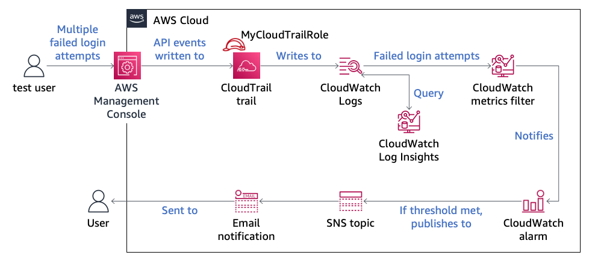

# AWS Lab 6.1 Notes – Monitoring & Alerting (CloudWatch / CloudTrail)

**Environment:** AWS Skill Builder Lab  
**Focus:** SNS, EventBridge, CloudWatch Alarms, CloudTrail Logs  

---


## Task 2 – SNS Topic + Email Alerts

### Create SNS Topic
- Service: **SNS → Topics**
- Name: `MySNSTopic`
- Access:
  - Publish: Everyone
  - Subscribe: Everyone

### Create Subscription
- Protocol: **Email**
- Confirm via email link

### Key Concept
- SNS = notification system (email alerts for events)

---

## Task 3 – EventBridge Rule (Security Group Monitoring)

### Create Rule
- Name: `MonitorSecurityGroups`
- Event bus: `default`
- Type: **Event pattern**

### Event Pattern
```json
{
  "source": ["aws.ec2"],
  "detail-type": ["AWS API Call via CloudTrail"],
  "detail": {
    "eventSource": ["ec2.amazonaws.com"],
    "eventName": ["AuthorizeSecurityGroupIngress", "ModifyNetworkInterfaceAttribute"]
  }
}
```

### Target

* Type: SNS
* Topic: `MySNSTopic`
* Disable execution role

### Input Transformer

```json
{"name":"$.detail.requestParameters.groupId","source":"$.detail.eventName","time":"$.time","value":"$.detail"}
```

Template:

```
The <source> API call was made against the <name> security group on <time> with the following details: <value>
```

---

## Task 3b – Trigger Rule

### Modify Security Group

* EC2 → Instances → `LabInstance`
* Security tab → Security group
* Inbound rules:

  * Add **SSH (22)**
  * Source: Anywhere (0.0.0.0/0)

### Result

* Event: `AuthorizeSecurityGroupIngress`
* EventBridge triggers → SNS sends email

---

## Task 4 – CloudWatch Metric Filter + Alarm

### Create Metric Filter

* CloudWatch → Logs → Log groups → `CloudTrailLogGroup`

Filter pattern:

```
{ ($.eventName = ConsoleLogin) && ($.errorMessage = "Failed authentication") }
```

### Metric Config

* Filter name: `ConsoleLoginErrors`
* Namespace: `CloudTrailMetrics`
* Metric name: `ConsoleLoginFailureCount`
* Value: `1`

---

### Create Alarm

* Metric: `ConsoleLoginFailureCount`
* Statistic: **Sum**
* Period: **5 minutes**

### Condition

* Trigger when: **Greater/Equal**
* Threshold: **3**

### Actions

* SNS Topic: `MySNSTopic`

### Alarm Name

* `FailedLogins`

---

## Task 4b – Trigger Alarm

### Simulate Failed Logins

* IAM → Users → `test`
* Copy **console sign-in link**
* Open in new/incognito tab

Login:

```
username: test
password: test
```

* Repeat **3+ times**

### Result

* Metric increments
* Alarm state → **In alarm**
* Email notification sent

---

## Verification

### CloudWatch

* Metrics → `CloudTrailMetrics`
* See `ConsoleLoginFailureCount`

### Alarms

* `FailedLogins` → **In alarm**

---

## Task 5 – Logs Insights Query

### Run Query

CloudWatch → Logs Insights → select `CloudTrailLogGroup`

```sql
filter eventSource="signin.amazonaws.com" 
and eventName="ConsoleLogin" 
and responseElements.ConsoleLogin="Failure"
| stats count(*) as Total_Count 
by sourceIPAddress as Source_IP, 
errorMessage as Reason, 
awsRegion as AWS_Region, 
userIdentity.arn as IAM_Arn
```

### Purpose

* Analyze failed login attempts
* Identify source IP + user

---

## Key Concepts

* **CloudTrail** → logs API activity 
* **SNS** → sends alerts (email) 
* **EventBridge** → reacts to events (security group changes) 
* **CloudWatch** → metrics + alarms 

---

## Overall Flow

```
CloudTrail → EventBridge → SNS → Email alert
CloudTrail Logs → Metric Filter → CloudWatch Alarm → SNS → Email
```

---

## Notes / Gotchas

* Metric name must be exact: `ConsoleLoginFailureCount`
* Alarm threshold must be: `>= 3`
* Use IAM login link (not main console) to trigger failures
* Wait ~1–2 minutes for alarm state update
* SNS email must be **confirmed**

---

